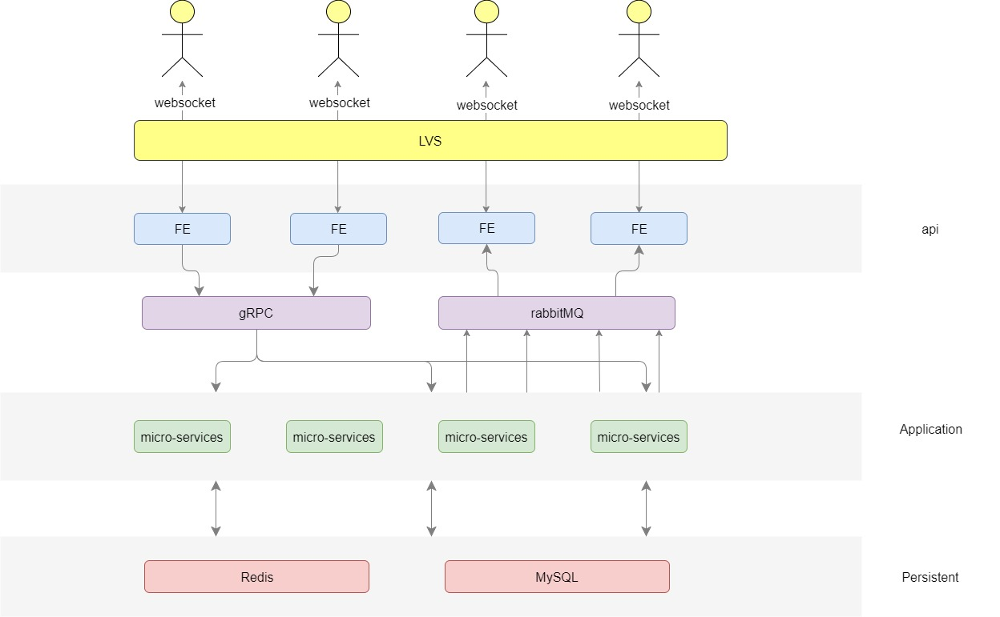

# thrones

## 一. 系统整体架构

### （一）系统架构图

### （二）系统设计规范
#### 1. 用户使用webSocket与api层进行数据通信，单客户端的所有上下行数据均通过唯一长连接完成。
#### 2. api层不包含业务逻辑。api层功能约定如下：
##### 维护webSocket连接。
##### 维护消息队列topic与用户的映射关系。
##### 用户请求和消息的解析、校验、转发。
#### 3. api层与service层交互过程：
##### 下行数据使用gRPC接口，接口只返回处理状态。
##### 上行数据通过rabbitMQ的消息机制通知api层同组中的所有机器，实现处理结果的广播。
#### 4. ==*持久化层：== 
##### 由于游戏场景的特殊性，实时的对局状态存储在redis。
##### 注册用户信息，历史聊天记录等存储在MySQL。

